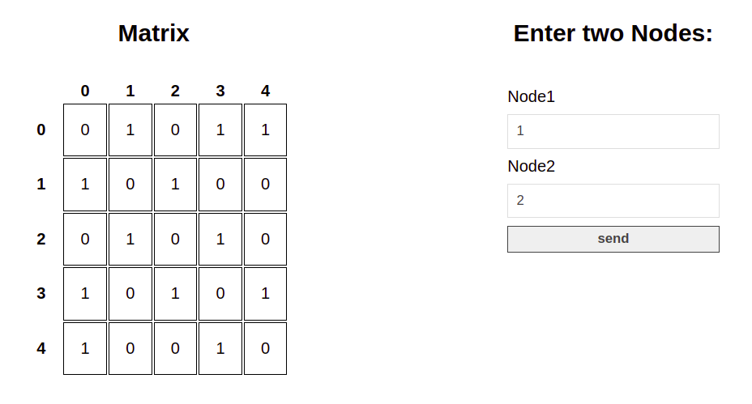

# Challenge Python

- En el archivo `challenge.py` se encuentra la solución del problema.
- Realize una aplicación en `Flask` para visualizar la matriz de adyacencia de una gráfica y consultar si dos vértices son adyacentes.
  

